# Database Design — Distribution Peinture (Flutter Clone)

Reference schema for the Flutter clone of **Peinture distribution** (`DistributionPeinture`).

## Overview

| Aspect | Detail |
|--------|--------|
| **Source project** | Peinture distribution (C# / Avalonia) |
| **ORM (Flutter target)** | Drift |
| **Database engine** | SQLite |
| **Database file** | `%AppData%\DistributionPeinture\data.db` |
| **Tables** | 34 |

Most business tables share common audit columns via `BaseEntity`. Exceptions: `Users`, `RemisesCaisse`, and `AppSettings`.

---

## Common Base Columns (`BaseEntity`)

Present on all business tables **except** `Users`, `RemisesCaisse`, and `AppSettings`:

| Column | Type | Description |
|--------|------|-------------|
| `Id` | INTEGER PK | Auto-increment primary key |
| `CreatedAt` | TEXT (DateTime) | Creation timestamp (UTC) |
| `UpdatedAt` | TEXT (DateTime) | Last update timestamp (UTC) |
| `CreatedByUserId` | INTEGER NULL | User who created the record |

---

## Entity Relationship Diagram

```mermaid
erDiagram
    Users ||--o| StockLocations : "VirtualStock (1:1)"
    Users ||--o{ BonsLivraison : "VendeurId"
    Users ||--o{ BonsCharge : "AssignedToUserId"
    Users ||--o{ BonsDecharge : "AssignedToUserId"
    Users ||--o{ RemisesCaisse : "AssignedToUserId"

    Tiers ||--o{ Devis : "ClientId"
    Tiers ||--o{ BonsCommandeClient : "ClientId"
    Tiers ||--o{ BonsLivraison : "ClientId"
    Tiers ||--o{ Factures : "ClientId"
    Tiers ||--o{ Avoirs : "ClientId"
    Tiers ||--o{ BonsCommande : "FournisseurId"
    Tiers ||--o{ BonsReception : "FournisseurId"
    Tiers ||--o{ FacturesFournisseurs : "FournisseurId"
    Tiers ||--o{ AvoirsFournisseurs : "FournisseurId"

    Categories ||--o{ Produits : "CategorieId"
    Produits ||--o{ MouvementsStock : "ProduitId"

    StockLocations ||--o{ MouvementsStock : "FromLocationId"
    StockLocations ||--o{ MouvementsStock : "ToLocationId"
    StockLocations ||--o{ BonsCharge : "DepotLocationId"
    StockLocations ||--o{ BonsDecharge : "DepotLocationId"

    Devis ||--|{ DevisLignes : "DevisId"
    BonsCommandeClient ||--|{ BonCommandeClientLignes : "BonCommandeClientId"
    BonsCommandeClient }o--o| Factures : "FactureId"
    BonsLivraison }o--o| BonsCommandeClient : "BonCommandeClientId"
    BonsLivraison }o--o| Factures : "FactureId"
    BonsLivraison ||--|{ BonLivraisonLignes : "BLId"
    BonsLivraison ||--|{ PaiementsBonLivraison : "BonLivraisonId"

    Factures ||--|{ FactureLignes : "FactureId"
    FactureLignes }o--o| BonsLivraison : "BonLivraisonId"
    Avoirs }o--o| Factures : "FactureId"
    Avoirs ||--|{ AvoirLignes : "AvoirId"

    BonsCommande ||--|{ BonCommandeLignes : "BonCommandeId"
    BonsReception }o--o| BonsCommande : "BonCommandeId"
    BonsReception }o--o| FacturesFournisseurs : "FactureFournisseurId"
    BonsReception ||--|{ BonReceptionLignes : "BRId"

    FacturesFournisseurs ||--|{ FactureFournisseurLignes : "FactureFournisseurId"
    FacturesFournisseurs ||--|{ PaiementsFournisseurs : "FactureFournisseurId"
    FactureFournisseurLignes }o--o| BonsReception : "BonReceptionId"
    AvoirsFournisseurs ||--|{ AvoirFournisseurLignes : "AvoirFournisseurId"

    TypesCharges ||--o{ Charges : "TypeChargeId"
    BonsCharge ||--|{ BonChargeLignes : "BonChargeId"
    BonChargeLignes }o--|| Produits : "ProduitId"
    BonsDecharge ||--|{ BonDechargeLignes : "BonDechargeId"
    BonDechargeLignes }o--|| Produits : "ProduitId"
```



---

## Document Workflows

### Sales (client side)

```text
Devis → BonCommandeClient → BonLivraison → Facture
                              ↓
                        PaiementsBonLivraison
                              ↓
                            Avoir
```

### Purchases (supplier side)

```text
BonCommande → BonReception → FactureFournisseur
                                  ↓
                          PaiementsFournisseurs
                                  ↓
                          AvoirFournisseur
```

### Personnel / vendor stock

```text
Dépôt (physical) → BonCharge → Stock vendeur (virtual)
Stock vendeur → BonDecharge → Dépôt (physical)
Stock vendeur → BonLivraison (sale) / RemiseCaisse
```

### Stock location rules (FesDistribution — differs from Peinture)

**All sales go through vendeurs.** Physical depots never sell directly.

| Operation | Physical depot | Vendeur stock (virtual) |
|-----------|----------------|-------------------------|
| Adjustment (`Inventaire`) | yes | yes (car count correction) |
| Transfer (`Transfert`) | depot ↔ depot only | no |
| BonCharge / BonDecharge | source / destination | destination / source |
| BonLivraison (sale) | **never** | always — stock leaves the vendeur's car |
| Avoir client (return) | never | goods return to the vendeur's car |
| BonReception (purchase) | goods enter a depot | never |
| AvoirFournisseur | goods leave a depot | never |

Peinture seeds a pseudo-vendeur `admin` / phone `DEPOT-PRINCIPAL` so a BL can be sold from the depot. FesDistribution **does not** create it (existing rows are removed on open), and `BonsLivraison.VendeurId` must always reference a real vendeur.

---

## Tables

### Auth

#### `Users`

| Column | Type | Constraints | Description |
|--------|------|-------------|-------------|
| `Id` | INTEGER | PK | |
| `FullName` | TEXT(200) | NOT NULL | |
| `Phone` | TEXT(50) | UNIQUE, NOT NULL | Login identifier |
| `UserType` | TEXT(20) | default `'Vendeur'` | `'Vendeur'` or `'Admin'` |
| `Actif` | INTEGER (bool) | default `true` | |
| `CreatedAt` | TEXT | NOT NULL | No `UpdatedAt` on this table |

**Relation:** 1:1 with a virtual `StockLocations` row per vendor.

---

### Tiers

#### `Tiers`

| Column | Type | Description |
|--------|------|-------------|
| `Id` | INTEGER PK | |
| `Nom` | TEXT NOT NULL | Name |
| `Type` | INTEGER | `0=Client`, `1=Fournisseur`, `2=LesDeux` |
| `ICE` | TEXT | Tax ID |
| `Telephone`, `Email`, `Adresse`, `Ville` | TEXT | Contact info |
| `ConditionsPaiement` | TEXT | Payment terms |
| `MaxCredit` | TEXT (decimal) NULL | Client credit limit |
| `Actif` | INTEGER (bool) | |
| + BaseEntity | | |

---

### Stock

#### `Categories`

| Column | Type |
|--------|------|
| `Id` | INTEGER PK |
| `Nom` | TEXT NOT NULL |
| + BaseEntity |

#### `Produits`

| Column | Type | Constraints | Description |
|--------|------|-------------|-------------|
| `Id` | INTEGER | PK | |
| `Reference` | TEXT | UNIQUE, NOT NULL | Product reference |
| `CodeBarre` | TEXT NULL | | Barcode |
| `Designation` | TEXT | NOT NULL | |
| `Unite` | TEXT | NOT NULL | Unit (kg, pcs, etc.) |
| `PrixAchatHT` | TEXT (decimal) | | Purchase price |
| `PrixVenteHT` | TEXT (decimal) | | Sale price |
| `TauxTVA` | TEXT (decimal) | | VAT rate |
| `StockMinimum` | TEXT (decimal) | | Minimum stock alert |
| `CategorieId` | INTEGER NULL | FK → `Categories`, SET NULL | |
| `ImageData` | BLOB NULL | | Product photo |
| `Actif` | INTEGER (bool) | | |
| + BaseEntity | | | |

**Note:** `StockActuel` is computed across locations — not stored on the product row.

#### `StockLocations`

| Column | Type | Constraints | Description |
|--------|------|-------------|-------------|
| `Id` | INTEGER | PK | |
| `Nom` | TEXT(200) | NOT NULL | Location name |
| `IsVirtual` | INTEGER (bool) | | `true` = vendor stock |
| `UserId` | INTEGER NULL | UNIQUE when virtual | FK → `Users` |
| `Actif` | INTEGER (bool) | | |
| + BaseEntity | | | |

**Check constraint:** `(IsVirtual = 0 AND UserId IS NULL) OR (IsVirtual = 1 AND UserId IS NOT NULL)`

**Seed data:** Id=1, `"Dépôt principal"` (physical depot)

#### `MouvementsStock`

| Column | Type | Constraints | Description |
|--------|------|-------------|-------------|
| `Id` | INTEGER | PK | |
| `ProduitId` | INTEGER | FK → `Produits`, RESTRICT | |
| `FromLocationId` | INTEGER NULL | FK → `StockLocations` | Source (null = outside) |
| `ToLocationId` | INTEGER NULL | FK → `StockLocations` | Destination (null = outside) |
| `Quantite` | TEXT (decimal) | Always positive | |
| `FromApres` | TEXT (decimal) NULL | Stock at source after move | |
| `ToApres` | TEXT (decimal) NULL | Stock at destination after move | |
| `OrigineType` | TEXT NOT NULL | Document type (BL, BR, etc.) | |
| `OrigineId` | INTEGER NULL | Source document ID | |
| `Note` | TEXT NOT NULL | | |
| + BaseEntity | | | |

**Movement type** (derived in code, not stored):

| From | To | Type |
|------|----|------|
| null | set | Entrée |
| set | null | Sortie |
| set | set | Transfert |
| otherwise | | Ajustement |

---

### Sales documents

#### `Devis` / `DevisLignes`

| Devis columns | |
|---------------|--|
| `Numero`, `ClientId` (FK), `Date`, `DateValidite`, `RemiseGlobale`, `Note` | |
| + BaseEntity | |

Line items: `ProduitId`, `Designation`, `Conditionnement`, `Quantite`, `PrixUnitaireHT`, `Remise`, `TauxTVA`

#### `BonsCommandeClient` / `BonCommandeClientLignes`

| BonsCommandeClient columns | |
|----------------------------|--|
| `Numero`, `ClientId` (FK), `Date`, `DevisId` (logical), `FactureId` (FK, SET NULL), `Note` | |
| + BaseEntity | |

Lines use `QuantiteCommandee`.

#### `BonsLivraison` / `BonLivraisonLignes` / `PaiementsBonLivraison`

| BonsLivraison columns | |
|-----------------------|--|
| `Numero`, `ClientId` (FK), `VendeurId` (FK → Users), `BonCommandeClientId` (FK), `FactureId` (FK), `DevisId` (logical), `Date`, `DateEcheance`, `EstPayee`, `RemiseGlobale`, `TotalTtc`, `Note` | |
| + BaseEntity | |

**BL lines:** `QuantiteCommandee`, `QuantiteLivree`

**Payments** (`PaiementsBonLivraison`): `Date`, `Montant`, `Mode`, `Reference` — client payments happen on BL, not on `Factures`.

#### `Factures` / `FactureLignes`

| Factures columns | |
|------------------|--|
| `Numero`, `ClientId` (FK), `Date`, `DateEcheance`, `EstPayee`, `RemiseGlobale`, `TotalTtc`, `BonCommandeReference`, `DevisId` (logical), `Note` | |
| + BaseEntity | |

**FactureLignes** can link back to a BL via `BonLivraisonId`.

#### `Avoirs` / `AvoirLignes`

| Avoirs columns | |
|----------------|--|
| `Numero`, `ClientId` (FK), `FactureId` (FK, SET NULL), `Date`, `Motif`, `RetourMarchandise` | |
| + BaseEntity | |

---

### Purchase documents

#### `BonsCommande` / `BonCommandeLignes`

| BonsCommande columns | |
|----------------------|--|
| `Numero`, `FournisseurId` (FK), `Date`, `Note` | |
| + BaseEntity | |

Lines: `QuantiteCommandee`

#### `BonsReception` / `BonReceptionLignes`

| BonsReception columns | |
|-----------------------|--|
| `Numero`, `FournisseurId` (FK), `BonCommandeId` (FK), `FactureFournisseurId` (FK), `Date`, `TotalTtc`, `Note` | |
| + BaseEntity | |

Lines: `QuantiteRecue`

#### `FacturesFournisseurs` / `FactureFournisseurLignes` / `PaiementsFournisseurs`

| FacturesFournisseurs columns | |
|------------------------------|--|
| `Numero`, `FournisseurId` (FK), `Date`, `DateEcheance`, `EstPayee`, `RemiseGlobale`, `TotalTtc`, `Note` | |
| + BaseEntity | |

**FactureFournisseurLignes** can link to `BonReceptionId`.

#### `AvoirsFournisseurs` / `AvoirFournisseurLignes`

| AvoirsFournisseurs columns | |
|------------------------------|--|
| `Numero`, `FournisseurId` (FK), `Date`, `Motif`, `RetourMarchandise` | |
| + BaseEntity | |

---

### Personnel / vendor stock

#### `BonsCharge` / `BonChargeLignes`

Load stock from depot onto a vendor.

| BonsCharge columns | Constraints |
|--------------------|-------------|
| `Numero` | TEXT(50), UNIQUE |
| `AssignedToUserId` | FK → `Users` |
| `DepotLocationId` | FK → `StockLocations`, default `1` |
| `Date`, `Note` | |
| + BaseEntity | |

**BonChargeLignes:** `BonChargeId`, `ProduitId` (FK), `Designation`, `Quantite`, `PrixUnitaireHT`, `Remise`, `TauxTVA`

#### `BonsDecharge` / `BonDechargeLignes`

Unload/return stock from vendor. Same structure as `BonsCharge`.

#### `RemisesCaisse`

Cash handover from vendor.

| Column | Type | Constraints |
|--------|------|-------------|
| `Numero` | TEXT(50) | UNIQUE |
| `AssignedToUserId` | INTEGER | FK → `Users` |
| `Date`, `Montant`, `Mode`, `Note` | | |
| `CreatedAt`, `UpdatedAt` | | No `CreatedByUserId` |

---

### Charges (expenses)

#### `TypesCharges`

| Column | Type | Constraints |
|--------|------|-------------|
| `Nom` | TEXT(128) | UNIQUE, NOT NULL |
| `Actif` | INTEGER (bool) | |
| + BaseEntity | | |

#### `Charges`

| Column | Type | Constraints |
|--------|------|-------------|
| `TypeChargeId` | INTEGER | FK → `TypesCharges`, RESTRICT |
| `Libelle` | TEXT(256) | NOT NULL |
| `Date` | TEXT (DateTime) | Indexed |
| `MontantTtc` | TEXT (decimal) | |
| `Note` | TEXT | |
| + BaseEntity | | |

---

### App configuration

#### `AppSettings`

Does **not** use `BaseEntity`. Singleton-style configuration row.

| Column | Type | Description |
|--------|------|-------------|
| `Id` | INTEGER PK | |
| `SocieteNom` | TEXT | Company name |
| `SocieteAdresse` | TEXT | Address |
| `SocieteICE` | TEXT | Tax ID |
| `SocieteLogoPath` | TEXT NULL | Logo path |
| `SocieteMentionsLegales` | TEXT NULL | Legal mentions |
| `Devise` | TEXT | Currency |
| `TauxTVAJson` | TEXT | VAT rates (JSON) |
| `DocumentNumberingFloorsJson` | TEXT | Document numbering config |
| `DevisValiditeJoursDefaut` | INTEGER | Default quote validity |
| `BlocageSiStockInsuffisant` | INTEGER (bool) | Block if insufficient stock |
| `EnableVirtualKeyboard` | INTEGER (bool) | UI option |
| `UiLanguage` | TEXT | UI language |
| `BackupEnabled` | INTEGER (bool) | |
| `BackupDirectory` | TEXT | |
| `BackupIntervalHours` | INTEGER | |
| `BackupIntervalUnit` | TEXT | |
| `BackupRetentionDays` | INTEGER | |
| `LastBackupDate` | TEXT NULL | |
| `LicenseKey` | TEXT NULL | |
| `TrialStartedAt` | TEXT NULL | |

---

## Enums

| Enum | Values |
|------|--------|
| **UserType** | `Vendeur (0)`, `Admin (1)` |
| **TypeTiers** | `Client (0)`, `Fournisseur (1)`, `LesDeux (2)` |
| **TypeMouvement** | `Entree`, `Sortie`, `Ajustement`, `Transfert` *(derived, not stored)* |
| **ModePaiement** | `Credit (0)`, `Cheque (1)`, `Especes (2)`, `TPE (3)`, `Virement (4)`, `Effet (5)` |

---

## Module Grouping

| Module | Tables |
|--------|--------|
| Auth | `Users` |
| Tiers | `Tiers` |
| Stock | `Categories`, `Produits`, `StockLocations`, `MouvementsStock` |
| Devis | `Devis`, `DevisLignes` |
| Commande client | `BonsCommandeClient`, `BonCommandeClientLignes` |
| Livraison | `BonsLivraison`, `BonLivraisonLignes`, `PaiementsBonLivraison` |
| Facturation | `Factures`, `FactureLignes`, `Avoirs`, `AvoirLignes` |
| Commande fournisseur | `BonsCommande`, `BonCommandeLignes` |
| Réception | `BonsReception`, `BonReceptionLignes` |
| Facture fournisseur | `FacturesFournisseurs`, `FactureFournisseurLignes`, `PaiementsFournisseurs` |
| Avoir fournisseur | `AvoirsFournisseurs`, `AvoirFournisseurLignes` |
| Charges | `TypesCharges`, `Charges` |
| Personnel | `BonsCharge`, `BonChargeLignes`, `BonsDecharge`, `BonDechargeLignes`, `RemisesCaisse` |
| Settings | `AppSettings` |

---

## Drift Mapping Notes

- One Drift table file per SQLite table under `db/entities/`.
- Use `schemaVersion` + `MigrationStrategy` in `app_database.dart` for schema changes.
- Business models in `business/models/` map to/from Drift row classes via `business/mappers/`.
- Multi-table operations (validate BL, bon charge, payments) must run inside Drift transactions.

---

## Implementation Phases

| Phase | Scope |
|-------|-------|
| 1 | Users, Tiers, Categories, Produits, StockLocations, MouvementsStock, AppSettings |
| 2 | Devis, BonCommandeClient, BonLivraison, PaiementsBonLivraison |
| 3 | Factures, Avoirs |
| 4 | BonCommande, BonReception, FactureFournisseur, AvoirFournisseur |
| 5 | BonCharge, BonDecharge, RemiseCaisse, Charges |
| 6 | Reporting, PDF, backup |
